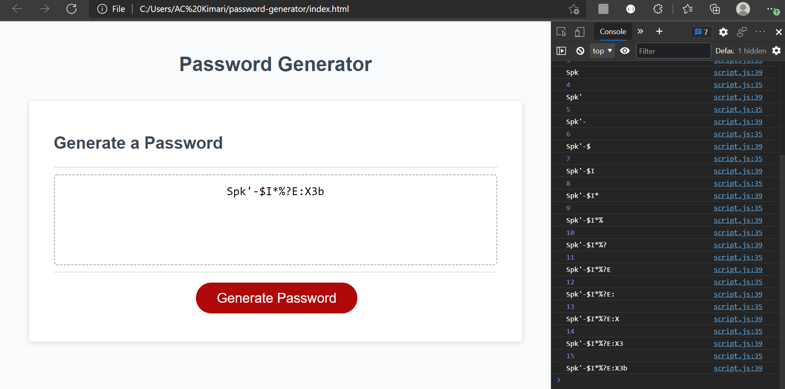
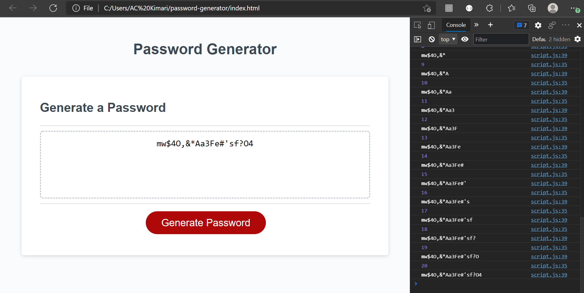
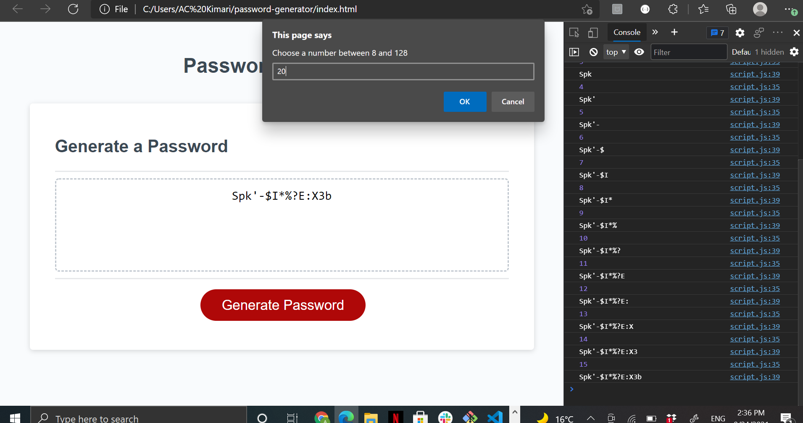

# Password Generator

## Project Description

This Project was challenging and mysteriously fun to do. I was able to hack it and within the process, I learned so many new codes via research on how to tackle certain steps. My motivation was not having an error on my console. 

I built this project to understand the coding elements used to generate passwords as it's a prevalent and important feature in the tech world! It solves the problem of being hacked and having sensitive information or data leaked or publicized. 

This project taught me of the need to fully understand coding terms/elements so as to excecute them with ease. It also taught me and showed me the beauty of Javascript in coding. 

I will be utilizing this project in my future vocations.

## Installation

Step 1: Create variables to store the information needed to generate the password as a string or array => globally.

Step 2: Start a function => generatePassword()

Step 3: Prompt the user for their password length => check that this value is: >a number, >8 or more characters, >128 or less characters => make sure this meets criteria.

Step 4: Set up a series of confirm that has the user decide if they would like to include lowercase, uppercase, numbers, and/or special characters.

Step 5: Take confirms and combine the true into a holder.

Step 6: Check that the user has selected at least one type. (if/else if/else statements)

Step 7: Randomize the combined types => Math.floor & Math.random

Step 8: Return

## Usage

## Credits

Steps: TA Louis Coleman